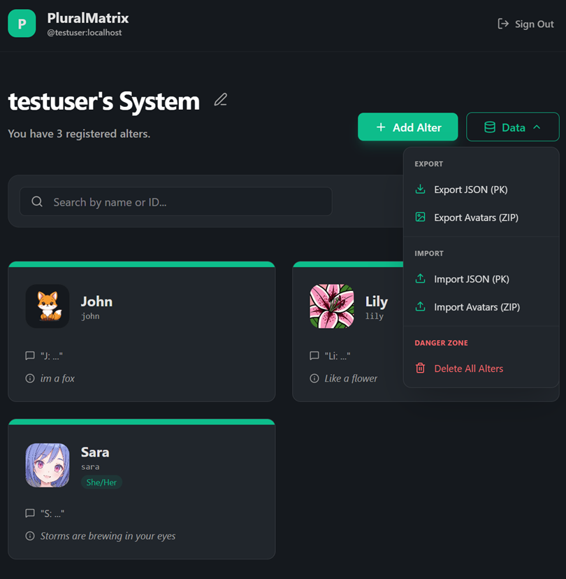

#  PluralMatrix

PluralMatrix is a Matrix Application Service designed for plural systems using Matrix, the open-source alternative to Discord. As in PluralKit, message prefixes are used to speak as each system member. But in PluralMatrix, every system member is represented by a unique "ghost" user who automatically joins rooms and sends messages on that member's behalf, providing a more native Matrix experience.

**Note on Compatibility:** While the "Zero-Flash" feature (which instantly hides trigger messages) requires a custom module installed on a Synapse homeserver, all other PluralMatrix features—including E2EE support and the dashboard—are compatible with any standard Matrix server.

## Visuals

<div align="center">
  
  <br>
  
  
</div>

## Core Features

### High-Fidelity Proxying ("Zero-Flash")
- **Instant Cleanup:** A custom Synapse module intercepts and drops original proxy trigger messages before they are stored, ensuring a clean timeline without original messages ever appearing.
- **Rich Presence:** Proxied messages use custom display names, avatars, and system tags.
- **Relation Preservation:** Full support for replies and other Matrix event relations.

### Hybrid E2EE Support
- **Transparent Decryption:** A dedicated sidecar service handles end-to-end encrypted rooms via Pantalaimon, allowing the bot to proxy even in secure environments.
- **Secure by Design:** Automated registration and secure credential management for decryption ghosts.

### Modern Dashboard
- **Web-based Management:** A React-based UI for managing system members, settings, and avatars.
- **Matrix Authentication:** Sign in directly using your Matrix credentials.
- **Live Sync:** Real-time updates to ghost profiles and proxy rules.

### Data Portability (PluralKit Compatible)
- **Easy Migration:** Import your system directly from a PluralKit JSON export.
- **Full Exports:** Export your system data and avatar assets (ZIP) for backup or migration.
- **Roundtrip Fidelity:** Maintains IDs and slugs for consistent cross-platform use.

### Advanced Bot Commands
These commands are designed to work exactly like their PluralKit equivalents for familiarity and ease of use.

- `pk;list`: View all system members.
- `pk;member <slug>`: View detailed information about a member.
- `pk;e <text>`: Edit your last proxied message or a specific replied-to message.
- `pk;rp <slug>`: Change the identity of a previously proxied message (Reproxy).
- `pk;message -delete`: Remove a proxied message.
- **Emoji Reactions:** React with ❌ to any proxied message to delete it instantly.

### Smart System Management
- **Automatic Slugs:** Generates clean, unique IDs for members from names or descriptions.
- **Ghost Decommissioning:** Automatically cleans up ghost users and their room memberships when a member is deleted.
- **Profile Syncing:** Ensures global Matrix profiles stay in sync with your system dashboard.

## Installation & Setup

### Prerequisites
- Docker & Docker Compose
- A Matrix Homeserver (Synapse required for Zero-Flash support)

### Quick Start
1. Clone the repository.
2. Run the setup script:
   ```bash
   ./setup.sh
   ```
3. Run the restart script to initialize the services:
   ```bash
   ./restart-stack.sh
   ```
4. Invite `@plural_bot:yourdomain.com` to the rooms you wish to use it in.
5. Access the dashboard at `http://localhost:9000`.

**Note:** By default, PluralMatrix launches its own Synapse demo server for local testing, but it can be easily configured to integrate with any existing Matrix homeserver.

## Testing
Run the comprehensive test suite to verify full-stack functionality:
```bash
cd app-service && npm test
```
